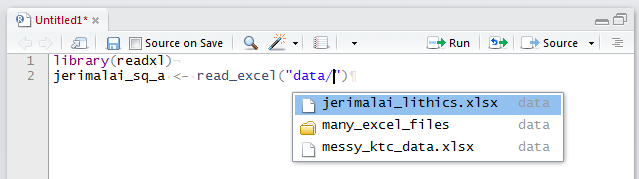
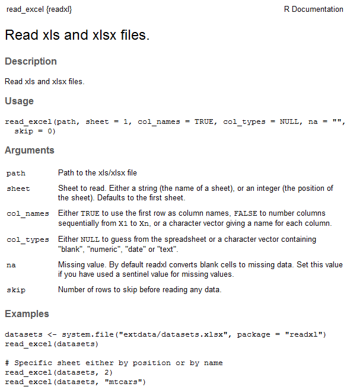
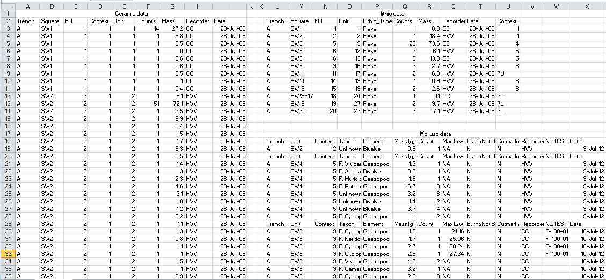
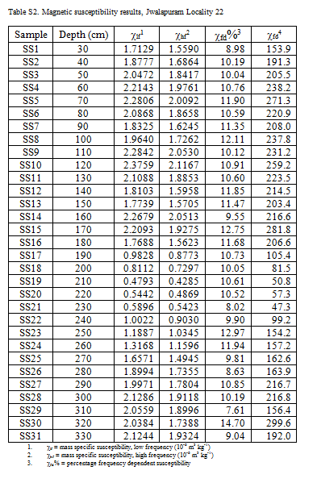
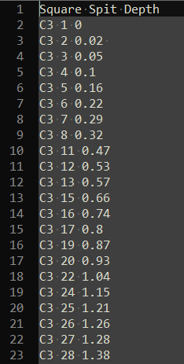
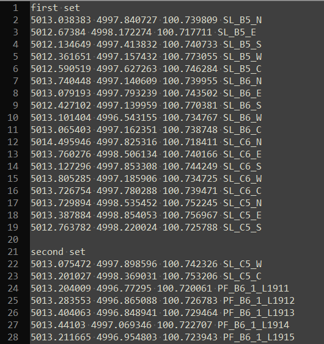

---
output:
  word_document: default
  html_document: default
---
```{r echo=FALSE}
library(knitr)
opts_chunk$set(message = FALSE,
               warning = FALSE,
               cache = TRUE,
               fig.align = 'center',
               fig.width = 7)
```


# Getting data into R {#gettingdatain}
  
## Overview

In this chapter we will survey some of the key methods for getting data into R. The canonical method for many years has been to use the `read.csv` function with a CSV (comma separated variables) file. This is a decent approach because most file types that contain tabular data can be saved as CSV, for example, we can save Excel files as CSV using Microsoft Excel. CSV is also ideal because it is an open, plain-text format that can be widely read and edited by many different programs. It is suitable for long-term archiving because it is a stable format. However, it is often more convienent to work directly with the file that the data were entered into, and convienent to work with a format that our collaborators are comfortable with, such as an Excel spreadsheet. Fortunately, there are several packages that allow Excel, other common tabular data file formats, and even databases, to be read directly into R. The focus of much of this chapter is getting data stored in spreadsheets into R, ready to analyse. If you have spreadsheet-like data files from other software, such as SPSS, you can use `read_*` functions from Hadley Wickham's haven package in much the same way that you see `read_excel` used in this chapter. 

R is also capable of handling more challenging situations, such as working with hundreds or thousands of data files, reading tabular data from Microsoft Word documents or PDFs, and reading in data from unstructured plain text files. In this chapter we will briefly demonstrate how to handle these situations.

## Getting data from spreadsheets

### One spreadsheet file, one or more sheets

Although the CSV file might be the ideal format for tabular data, and the simplest to work with in R, in our day-to-day work with diverse collaborators usually means that we need to get data in and out of Microsoft Excel. There are many packages for working with Excel files (e.g. gdata and xlsx), but the one I recommend is readxl by Hadley Wickham because it is the simplest to install and use. You can install it with `install.packages("readxl")`. Here is a demonstration of a simple use of this package to read in one sheet of one Excel file:

```{r readxlsimple}
library(readxl)
jerimalai_sq_a <- read_excel("data/jerimalai_lithics.xlsx")
# if you have a CSV file, use read.csv() instead of read_excel()
```

As you type that code to import your own spreadsheets, you can save some typing with a special tab-complete function in RStudio. After you type `read_excel("")`, move your cursor between the two double quotation marks, and press tab (or Control+Space). A small window will pop up at that location, giving you a list of items to choose from, saving you from typing the full names of the path and file. Figure \@ref(fig:rstudiotabcompletefilebrowsing) shows an example of this, where you can see that I have tabbed once to get a list and select the 'data' folder, and then I've tabbed again to get a list of the contents of that folder. Then I can use the arrow keys to select, or type the first few letters of the file I want to complete the command. This kind of tab-completion is possible for many R functions, and can substantially increase the efficiency of your coding by reducing the amount of typing you need to do, and saving you from making spelling mistakes. 

```{r rstudiotabcompletefilebrowsing, echo = FALSE,  out.width = "400pt", fig.cap="Schematic of file organisation for a simple example of using an Excel file with R."}

```

Before discussing the new details in the example above, let's briefly review the elements of this code that will be familiar from Chapter 1. The first line of the above code chunk, `library(readxl)`, loads the functions in the readxl package into our current R session. The second line contains a function, `read_excel()`, this does the work of extracting data from our Excel file. We also see the assignment operator, `<-`, which takes the output from the `read_excel()` function and sends it to be stored in a new object that we have decided to call `jerimalai_sq_a`. This new object is a data frame, which is similar to how our data looks when we browse it in Excel. The data frame is a special kind of object in R for tabular data. Columns can be of any class of data (e.g. numeric, character, logical, etc.), but every value in a column must have the same class (i.e. we cannot mix numerics and characters in a single column, the numerics will be converted to characters). We can see the column names are as we expect them to be. If you want to get directly to working with your data now that you've imported it, skip to Chapter XX, otherwise read on to learn more about importing data. 

In this example we have an Excel file called `jerimalai_lithics.xlsx` that is located in a folder called `data`. Recalling the advice in Chapter 1, the first step when starting a session of work on data analysis is to set our Working Directory to the 'Source file location' (go to RStudio toolbar menu, click on 'Session', then 'Set Working Directory' then 'To Source File Location'). This means that if we've followed the file organisation recommendations of Chapter 2, we have a folder called `data` in the folder that contains the source document (i.e. this document that you are reading), then we can easily connect to files in that directly. In Figure \@ref(fig:simpleexcelfileorganisation) we see a schematic of this file organisation, with the source document to the left, and the Excel file in the 'data' folder to the right.

```{r simpleexcelfileorganisation, echo = FALSE, fig.cap="Schematic of file organisation for a simple example of using an Excel file with R."}

```

The Excel file in this example contains some of the data collected from excavations at Jerimalai rockshelter, East Timor [@MarwickJerimalai]. One row represents one stone artefact, and there are two sheets, one for each excavation square. To access the other sheet, we can look at the documentation for `read_excel()` by typing `?read_excel` in our console and pressing Enter. We can see in the 'Usage' and 'Arguments' sections of the documentation (Figure \@ref(fig:readexcelhelppage)) that there is an argument called `sheet` which we can use to specify what sheet in the Excel will be read into R. The text in 'Arguments' tells us that we can refer to sheets by number or the actual name of the sheet as it is in the Excel file. In the 'Usage' section we can see that the default value for `sheet` is 1. This means that if we don't specify what sheet we want, we will automatically get the first sheet in the Excel file. 

```{r readexcelhelppage, echo = FALSE, out.width = "400pt", fig.cap="Screenshot of the help page for the function read\\_excel."}

```

We can skip over most of the details on the `read_excel()` help page, but there is one more argument that is worth nothing because it is very handy. The `skip` argument allows us to specify a number of row to skip when importing from and Excel file. This is especially useful when our speadsheet has a row with merged cells at the top, perhaps to indicate groups of similiar variables (i.e. columns). We usually want to skip over these rows with merged cells when we import data from spreadsheets like this. For example, we might do `read_excel("data/jerimalai_lithics.xlsx", skip = 1)` to skip the first row of our spreadsheet (our example spreadsheet does not contain any merged cells in the first row, so we don't need to skip it for this spreadsheet).

If we wanted to read in the second sheet of our Excel file, which contains data on the stone artefacts from excavation square B, we have two options:

```{r readxlsimplesheets}
jerimalai_sq_b <- read_excel("data/jerimalai_lithics.xlsx",
                             sheet = 2) # using the sheet number

# or we can do it like this:

jerimalai_sq_b <- read_excel("data/jerimalai_lithics.xlsx",
                             sheet = "Jerimalai_All_Artefacts_Sq_B") 
# using the name of the sheet in our Excel file
```

I prefer to use the sheet name for the `sheet =` argument because if the order of sheets in the Excel file changes the function will no longer read in the correct data when `sheet = 2`. 

Now we have read in two sheets from our Excel file, and we have two data frames ready to work with in our R session. But what if we have a large number of sheets in a single Excel file? In this case it will be tedious to repeat these lines many times, changing the sheet name for each copy of the lines. Avoiding repititive tedium is one of the strengths of using a programmming language for data analysis, and here is how we can solve this particular problem:

```{r readmanysimpleexcelsheets}
# create a character vector of sheet names
jerimalai_sheet_names <- excel_sheets("data/jerimalai_lithics.xlsx")

# iterate over the vector of sheet names to read in the data from each sheet
library(purrr)
jerimalai_all_sheets <- map(jerimalai_sheet_names, 
                            ~read_excel("data/jerimalai_lithics.xlsx",
                                        sheet = .x))
```

In plain English, the above example uses the `excel_sheets()` function (from the readxl package) to get the sheet names from our Excel file. We have just two sheets in our example, but this same approach could be used for 10, or 100, or more sheets. The object `jerimalai_sheet_names` is a character vector containing the names of the sheets in our Excel file. The next part of the example loads functions from Hadley Wickham's purrr package, and then shows how we can use the `map()` function to apply to the `read_excel()` function to each sheet of our Excel file. For each item in the `jerimalai_sheet_names` vector, that is, each sheet name, the `map()` function will apply the `read_excel()` function, and store the resulting data frame in `jerimalai_all_sheets`. There are two important details in the `map()` function to note here, first is the `~`, which we use to indicate that we want the function `read_excel()` to operate on each element of `jerimalai_sheet_names`, and second is the `.x` which is a place-holder for each specific element of `jerimalai_sheet_names`.

In the above example we take advantage of a very powerful and efficient programming concept known as a loop or for-loop. This is an instruction to the computer to repeat a piece of code a specific number of times. In our example, the computer will repeat `read_excel()` two times, once for each sheet in our Excel file. During the first repitition, the `.x` in the `map()` function takes the value of `r jerimalai_sheet_names[1]`, the first sheet name, and during the second repitition the `.x` becomes `r jerimalai_sheet_names[2]`, the second sheet name. With just two repititions, this complexity might seem like overkill, but you can imagine how much time we would save if we had 50 or 500 sheets. There are other methods for writing for loops in R (e.g. using `for()` and `lapply()`), but I prefer `map()` for most occasions because it is quick to type and easy to read and understand when I come back to my code after some time away and can't immediately remember what is going on. For further reading about other methods of writing loops in R, I recommend de Vries and Meys [-@de2015r], Matloff [-@matloff2011art], or Wickham [-@wickham2014advanced].

The result of our `map()` function is a list of two data frames. A list is a very useful data type in R, and worth to get comfortable with. So far we have used vectors (a single sequence of data elements), such as the character vector `jerimalai_sheet_names` that holds the sheet names of our Excel file, and data frames, which are tables of data similar to what we see in Excel spreadsheets and other tabular structures. Often our data frames have one observation per row, with each column representing a variable, a measure, feature, or characteristic of that observation, but more exotic uses are also possible, such as storing lists in rows. Our jerimalai data frame is a good example of a typical data frame, with each row representing a single stone artefact (or observation) and each column represented a variable that we recorded for each artefact. So how is a list different from a vector or data frame? A list is a generic vector that can contain a mixture of any kind of object. We can have a list or several numeric vectors, or a list that includes several numeric, character and logical vectors, or a list of data frames, or a list of lists, and so on. Lists are the most versatile objects in R because we can store anything in them. 

### Mulitiple spreadsheet files

If we have a handful, or hundreds of spreadsheet files, we can take advantage of the same looping concept that we used for reading multiple sheets to quickly read all these files into our R session. In the example below we have a folder called many_excel_files that contains two Excel files (but it could be any number, 10, 100, 1000 or more files). We will make a character vector of the Excel file names, then we will loop over each file name to extract the data from each Excel file, one at a time, and collect the results in a list:

```{r manyexcelfiles}
# get the file names and store in a character vector
my_numerous_excel_files_names <- list.files("data/many_excel_files", 
                                      full.names = TRUE)

# apply the read_excel() function to each file in our vector of file names
my_numerous_excel_files_data <- map(my_numerous_excel_files_names, 
                                    ~read_excel(.x))
```

In this example we see the function `list.files()`, which is very useful, and comes built-in with R (we don't need to install a package for this one). As we use it here, `list.files()` creates a list of all the files in the many_excel_files folder. But sometimes we don't want to read in all the files, just a set of them, according to something they have in common. We can use the `pattern` argument to restrict the files that `list.files()` will list. For example, if we have a mix of text files and Excel files in a folder, but we only want to get a list of the Excel files, we can use pattern like this:

```{r listfiles}
only_my_excel_files <- list.files("data/many_excel_files", 
                                  pattern = ".xlsx$", 
                                  full.names = TRUE, 
                                  ignore.case = TRUE)
```

When we use `pattern = ".xlsx$"`, we are telling the computer that we only want to list files that have '.xlsx' at the end of their filename. The dollar sign requires that the characters `.xlxs` match our search only when they are at the end of the filename. For example, this filename would not match this pattern: `names_of_.xlsx_files.docx` because although it contains the string `.xlxs`, the end of the filename is `docx`, so it doesn't match our pattern. We can capture files ending with '.xlsx' or '.XLSX' by adding `ignore.case = TRUE`, which will ignore differences between upper and lower case characters. We can also use `pattern` to match other parts of the file names using regular expressions. For example, if we have many spreadsheets that are named in this format: 'region_name-site_name-square_name-recorder_initials.xlsx', we can write R code to select files that have the characters 'BM' only after the third '-' to get all the files for regions/sites/squares that I recorded. We will discuss how to use regular expressions to do this kind of selection in Chapter XX. 

Our use of `map()` in the above example is very similar to how we used it when we read in multiple sheets from one Excel file. We can see the common elements `~` (indicating the function to be repeated) and `.x` (a place-holder for each element of the vector that the function will operate on) in both examples. Similarly, the output we receive from the `map()` function in this example is a list of data frames. This approach is especially useful when we have a large number of Excel files that are similarly structured (i.e. the same number of columns with the same column names) because then we can also use `map()` to analyse the visualise that data.

### Importing messy spreadsheets, or when is it ok to manually edit the data?

In the examples so far, we have assumed that the data in the spreadsheet is a tidy rectangle in the upper left corner of the sheet, and does not contain any formatting or formulas that are important for our analyses. We introduced `skip` as a method to ignore rows with merged cells or other information that we don't need. However, what can we do if our Excel file contains a set of tables in a single sheet? Or when some bold text in some cells conveys important important information? The rexcel package by Rich FitzJohn and Jenny Bryan and the tidyxl package by Duncan Garmonsway can help with capturing data, formulae and formatting information from an Excel sheet. The jailbreakr package, also by Rich FitzJohn and Jenny Bryan can help with Excel files that contains a set of tables laid out on a single sheet. Similarly, the unpivotr package by Duncan Garmonsway can help with importing Excel spreadsheets containing complex or irregular layouts of into regular data frames in R. 

The use of these packages is difficult to generalise into a simple example because messy spreadsheets are often messy in their own way. Here I have contrived an example of a messy spreadsheet with three tables in one sheet \@ref(fig:messyexcel). The data come from Marwick et al. [-@MarwickVanVlack], and the code below shows how we can use the rexcel and jailbreakr packages to automatically identify the three minitables in the sheet, and extract them into a data frame for further work. 

```{r messyexcel, echo = FALSE, out.width = "400pt", fig.cap="Screenshot of a messy Excel sheet with three minitables on one sheet"}

```

In the code below, we use the `rexcel_read()` function to extract data, formatting and formulars from the spreadsheet into R. Then we use the `split_sheet()` function to classify our sheet into regions that contain tabular data. The output from `split_sheet()` is a list, and we can access the second item in the list (i.e. the secon minitable on the sheet) with `messy_ktc_split_sheet[[2]]` (for more about working with lists, see Chapter XX). To access the cell values for this second minitable, we use `messy_ktc_split_sheet[[2]]$values()`, and we apply the function `as.data.frame()` to convert the output to a data frame that we can work with.  

```{r messyspreadsheet}
# to install these packages, you'll need to run these lines:
# devtools::install_github(c("hadley/xml2", 
#                            "rsheets/linen", 
#                            "rsheets/cellranger", 
#                            "rsheets/rexcel", 
#                            "rsheets/jailbreakr"))

library(rexcel)
# read in the messy spreadsheet file
messy_ktc <- rexcel_read("data/messy_ktc_data.xlsx")

library(jailbreakr)
# automatically detect minitables within the sheet
messy_ktc_split_sheet <- split_sheet(messy_ktc)

# access one of the minitables
lithic_data <- as.data.frame(messy_ktc_split_sheet[[2]]$values())
```

Although these methods can make working with messy spreadsheets less painful, they raise the question of whether we should simply edit the spreadsheet manually so that it's more convienent for importing into R (e.g. moving the each of the tables onto their own sheet or own file, or creating a new column to represent the variable that was indicated by the bold text formatting). Manually editing is tempting because it could be quicker and less frustrating than importing the file as-is and write R code to arrange the data into a more useful form. 

The decision about whether to manually edit the data, or write code to arrange the data can be difficult. In my experience, it can take up to an hour or two to work out the code to take data from a messy spreadsheet and arrange it into a convienent form in R. On the other hand, it can take just a few minutes to manually edit the spreadsheet to prepare it for importing into R and be ready for use. If time is the only consideration, the choice may be obvious. However, manually editing the data is problematic because it can involve decisions that change the results of your analysis, but leave no trace and are impossible, or very inconvienent, to reverse. Making undocumented decisions in the data analysis workflow violates a key principle of reproducible research, that every decision about the data analysis should be documented in the analysis scripts. One way around this is to write a brief note that describes how you altered the data from its original form to the form you used to import into R. This note is included with the original, unaltered data, your new modified data in your project compendium so anyone can trace your steps in editing the data. There are some software packages that can help with this (e.g. <https://datproject.org/>), but I have not seen any in regular use among social scientists, so I am reluctant to make specific recommendations. 

One factor that might help you decide where to manually edit a spreadsheet or to write code to workaround the messy spreadsheet is whether or not other people need to edit the spreadsheet during to time that you are working with it. If your collaborators are still updating and circulating the spreadsheet while you are working on the analysis, then it may be disruptive if you reorganise the sheet in the middle of this process. In this situation it may be preferable to write code to handle the messiness. On the other hand, if the data in the spreadsheet is final and no further changes are being made by other people, then manual editing wont be disruptive to the collaboration process, and might be a better option. 

## Tabular data from non-spreadsheet programs: PDFs and Microsoft Word documents

While spreadsheets and spreadsheet-like data are easy to import into R, occasionally we need to get tabular data out of other kinds of documents for our analysis. This is often the case when we want to use data published in a report or as supplementary materials to a journal article. For small tables it may be practical to transcribe them into a spreadsheet by hand, and then read that spreadsheet into R using the methods described above. However, when you have large tables, or many tables across many pages or many documents this is undesirable because it is time consuming and will likely introduce transcription errors. 

Below is an example of how we can extract a table from a specific page of a PDF file of a journal article. Using Thomas Leeper's tabulizer package, we specify the file to operate on, and the page (or pages) to look for tables on. Consider the table in Figure \@ref(fig:terry-table-pic), which is from @Terry2000. This would be tedious to transcribe by hand, so we can use the extract_tables function from the tabulizer package to read the PDF and extract this table to use in R.

```{r terry-table-pic, fig.cap="A table of a data from a PDF file."}
knitr::include_graphics("images/page_from_Terry_et_ al_2000_[P].png")
```

In the example below, the `extract_tables()` function returns a list with one item. If a page has multiple tables, or text and tables, this list would have additional items. In the example below, the list item is a character matrix, which is the table that we want to work with. We can coerce the matrix to a data frame with `as_data_frame()` from the dplyr package, and then the table is nearly ready to work with in R. There are a few additional steps of cleaning to do before we can work with this table, such as moving the first and second rows out of the table and into the column headings, and coercing the measurement columns from character class to numeric class so they are suitable for numerical operations. We will investigate how to do these tasks when we discuss cleaning data in Chapter X. 

```{r}
library(tabulizer) # load the libraries
library(dplyr)

# read in the table from the PDF file
table_from_pdf <- extract_tables("data/Terry_et_al_2000_[P].pdf", 
                                 pages = 9)

# inspect the output of extract_tables(), here we acces the first item in the list
# and coerce to a data frame
as_data_frame(table_from_pdf[[1]])

# save as a CSV file easier downstream use and reuse by others
write.csv(table_from_pdf[[1]], "data/data_output/table_from_Terry_et_al_2000.csv")
```

The tabulizer package also has an interactive mode allowing you to click and drag a rectangle over a page to select the area to extract from. For large PDF files you can use the `split_pdf()` function to separate out the pages with tables to improve the performance of `extract_tables()`. Of course, after extracting the table from the PDF you should save it as a CSV file to ensure that it can more easily be resued in the future. 

We can similarly extract table from Microsoft Word documents using the Bob Rudis' docxtractr packages.The docxtractr package provides tools to count the number of tables in a documents, identify the table structure, and extract tables from Microsoft Word docx documents. The example below shows how we can extract a table of magnetic susceptibility data from the supplementary materials published in from @Haslam2012. Here is how the table looks in Microsoft Word:

```{r haslam-table-pic, fig.cap="A table of a data from a Microsoft Word file."}

```

And here is the code for extracting this table out of the complete supplementary materials document: 

```{r}
library(docxtractr) # load the library

# read in the docx file
docx_file <- read_docx("data/Haslam_et_al_2012_[Jwalapuram].docx")

# extract the second table in the docx file into a data frame
table_from_docx <- docx_extract_tbl(docx_file, tbl_number = 2)

# view the first few rows
head(table_from_docx)

# write to CSV file for easier reuse and achiving
write.csv(table_from_docx, "data/data_output/mag-sus-data-from-Haslam_et_al_2012.csv")
```

Notice that we do not get the Greek symbols in the data frame, nor do we get the comments below the table. The `docx_extract_tbl()` function only extracts the contents of the table, and exotic characters may be dropped.  

The docxtractr package does not have an interactive method like the tabulizer does for PDF files, but docxtractr has the `docx_describe_tbls()` function that can detect cells merged across rows or columns. It does not un-merge those cells, but it will help you identify where they are, so you can be more efficient with data cleaning. 

## Getting tabular data out of unstructured files

The methods above for working with spreadsheets and tables will likely cover the majority of cases for getting data into R, but occassionaly we have to work with data that is not stored in a convienently structured format. For example, some kinds of analytical instruments output data in plain text files that lack a convenient structure or widely used format. In that case, we can read the file in using more generic file reading functions. Consider this plain text file of excavation data with three columns of data, each column separated by a space:

```{r plain-text-table-pic, fig.cap="A table of a data from a plain text file (viewed in Notepad++)"}

```

We can use the function `read_table2()` from Hadley Wickham's readr package, this can read plain text files and identify columns that are separated by one or more white spaces. A 'white space' is one or more spaces, tabs, newlines characters or carriage return characters (i.e. a press of the 'enter' or 'return' key). Since our text file has space-separated columns, this function will automatically detect these, and place the data into a data frame. The `read_table2()` function is very similar to the base R `read.table()` function, which does not require installation of any packages. However, `read_table2()` has two major advantages which make it worth installing the readr package: first, the default settings are more convienent (with `read.table()` we also need to specify `stringsAsFactors = FALSE`), and it automatically detects the column classes and sets them for us. In the example below we see that the column classes are 'character', 'integer' and 'double', which is what we would expect them to be, and so they are immediately useful for calculation and visualisation, saving us a few steps of data cleaning. 

```{r}
library(readr) # load library

# read in unstructured data from plain text file
unstr_data <- read_table2("data/unstructured_data_simple_example.txt")

# inspect the result
head(unstr_data)
```

But what if we had a more complicated plain text document, say with series of table separatd by a blank line, and with each table having a short table on the line above the column headers? Consider the image below, which shows total statin data colleced during archaeological excavations at Madjedbebe [@Clarkson2015]: 

```{r plain-text-copmlex-table-pic, fig.cap="A table of a complex data from a plain text file (viewed in Notepad++)"}

```

One option is to manually edit the plain text file to save it as many separate files, with one table in each file. This is feasible for a small number of tables, but if we have hundreds of tables in a single plain text file we would prefer a more efficient method. We can use the `scan()` function to read this file into R, and then perform some operations to get it into a useful form:


```{r read-in-unstr-data-complex}
# read in the file
unstr_data_complex <- scan("data/unstructured_data_complex_example.txt", 
                          what = character(),
                          blank.lines.skip = FALSE)

# inspect the output
head(unstr_data_complex)
```

The result of the `scan()` function is a single character vector, where each item in the table is one item in the vector. No structure of the table is preserved in this character vector, we must impose this structure back on to the data, based on our knoweldge of the plain text file. The first detail to work on is that each table is separated by a blank line. To ensure that `scan()` sees these, we se the argument `blank.lines.skip =` to FALSE. Then, in the character vector resulting from `scan()`, we see the blanks lines as an empty element, `""`, in the vector. We can split this character vector on these empty elements to separate each table into its own object.

First we find the locations in the character vector of the empty elements that represent the blank lines. We can use `which()` to find the index values where the vector is equivalent to (`==`) the empty element:

```{r}
blank_line_locations <- which(unstr_data_complex == "")
```

They are at element numbers `r blank_line_locations[1]` and `r blank_line_locations[2]`. We can use these element numbers with `split_at()`, a function in the aswr package, to split the character vector at the blank line locations, and get a list of several vectors: 

```{r}
library(aswr)
list_of_tables <- split_at(unstr_data_complex, blank_line_locations)

# inspect the output
str(list_of_tables)
```

Because we know that the first element of the second and subsequent items in the list represents the empty line, we can delete it. We firstly select only the second and later elements of the list with `list_of_tables[2:length(list_of_tables)] `, and then we map over those elements and using negative indexing in square brackets to drop the first item in each character vector in those elements of the list: 

```{r}
library(purrr)

list_of_tables[2:length(list_of_tables)] <-
  map(list_of_tables[2:length(list_of_tables)], ~.x[-1])
```

Now we can take the table labels ('first set', 'second set', etc.) from the character vectors and into the list, to name the elements in the list. We map over each character vector in the list, extract the first two items in the vector with `.x[1:2`], paste them into a single item with `paste(.x[1:2], collapse = " ")`, and then simplify the result (which woult normally be a list using `map()`) into a character vector by using `map_chr`:

```{r}
table_labels <- map_chr(list_of_tables, ~paste(.x[1:2], collapse = " "))

# assign these labels to name the list items:
names(list_of_tables) <- table_labels
```

Now the table names are preserved in the list, we can delete them from the character vectors using negative indexing to drop the first two elements of each vector:

```{r}
list_of_tables <- map(list_of_tables, ~.x[-c(1:2)])
```

Now we want to transform each character vector into a table with four columns, as we see them in the plain text file. Because we know there are four columns, we can use the `seq()` function to extract values from every fourth position in the vector to extract each column. By starting at the first item and extracting every fourth item we get the first column, then starting at the second item and extracting every fourth item we get the second column, and so on. Then we have four vectors that can be combined into a data frame. I have spelled this out in detail for the first table in the file below:

```{r}
# Just transform the first character vector into a table with four cols:
x <- list_of_tables[[1]]

col1 <- x[seq(1, length(x), 4)]
col2 <- x[seq(2, length(x), 4)]
col3 <- x[seq(3, length(x), 4)]
col4 <- x[seq(4, length(x), 4)]

the_first_table <- data_frame(col1, col2, col3, col4)
```

But we want an approach that will operate automatically on each item in the list, to avoid copying and pasting this code, which is time consumring and error-inducing. The aswr package contains the function `df_from_vector()` that automates this process for a list of any length, and for tables of any number of columns. We supply the name of the list of character vectors, and the number of columns that each table should have, and we get a list of data frames in return:

```{r}
# process the list of character vectors into a list of data frames
list_of_data_frames <- 
  map(list_of_tables, ~df_from_vector(.x, 4))

# inspect the output
str(list_of_data_frames)
```

And now that list of data frames presents the data to use in a convienent tabular structure that is amenable for cleaning, analysis and visualisation. Some further cleaning is necessary, such as adding informative column names, but we have saved a lot of tedious manipulation of the file by hand with these few lines of code. However, this example does contain one detail that we can explore further, to better approximate an unstructured data file - that the table names in the raw data data will be exactly the same length (i.e. "first set", "second set", etc.). A more challenging data set would have table names of unpredictable length, requiring a slightly different strategy to read in the file and impose a tabular structure onto the text. To tackle this problem, we can start with `readLines()`, which reads in each row of the raw data as one element of a character vector:

```{r}
more_complex <- readLines("data/unstructured_data_more_complex_example.txt")
str(more_complex)
```

We can follow the same pattern as above by splitting this one large character vector by the empty elements, here we next `which()` in `split_at()` for more compact expression, and we can go ahead and remove the empty element (that we used to split on) from the second and subsequent list elements with `map()`:

```{r}
list_of_complex_tables <- split_at(more_complex, 
                                   which(more_complex == ""))

list_of_complex_tables[2:length(list_of_complex_tables)] <-
  map(list_of_complex_tables[2:length(list_of_complex_tables)], ~.x[-1])
```

Now we have a list, where each element is a character vector, and each element in the vectors is a row of the table. For example, each element looks something like this "5012.884297 4997.24741 100.707435 PF_B6_1_C14X232", with the four columns combined into one element, separated by a space. Our task now is to extract the table names and remove them from the character vectors, then transform the character vectors into a data frame.

Here we assign the first element of each vector to be the names of the list items:

```{r}
names(list_of_complex_tables) <- 
  map(list_of_complex_tables, ~.x[1])
```

And then remove that first item from the character vector, now that we have preserved it elsewhere:

```{r}
list_of_complex_tables <- 
  map(list_of_complex_tables, ~.x[-1])
```

Now we have a list of character vectors, and we can separate each item in the vector into four columns. Let's show how this can be done on the first item in the list, then generalise to all items in the list:

```{r}
library(dplyr) # load libraries
library(tidyr)

# extract the first item in the list
x <- list_of_complex_tables[[1]]

output <- 
  x %>% 
  data_frame(y = .) %>% 
  separate(col = y, 
           into = c("col1", "col2", "col3", "col4"), 
           sep = " ",
           convert = TRUE)
```

In the above example, we first extract the first item from the list, which we store as an object called 'x'. Then we convert this character vector into a data frame with one column using`data_frame()`, in this function we create a column called 'y', by assigning the character vector 'y' to this column. In this sequence of operations we are using the 'pipe' symbol, `%>%`, which we can translate as 'then', in the example above we can translate the first few lines as "Take the character vector 'x', then (`%>%`), place that vector into a column in a new data frame (`data_frame(y = .)`), and then separate", and so on. The specific task that the pipe does is to take the object to its left (in this case x) and pass it to the first function on its right (in this case `data_frame()`. We can specifically refer to the object taken by the pipe with a period `.`, so that the period in `data_frame(y = .)` refers to the object 'x' on the previous line. This pattern of piping objects from one function to another is highly readable, and often results in efficient, tidy code that is easy to understand and re-use.

After creating the data frame from the character vector, we then (`%>%`) pass this data frame to the `separate()` function from Hadley Wickham's tidyr package. The `separate()` function is designed to split one column in a data frame into multiple columns, so it is ideal for our problem of splitting the column we have into four new columns. In the `separate()` function, the first argument is the data frame with the column to split, in our example we this is passed in invisibly by the pipe symbol, and we do not need to type it. So the first argument that we need to explicity supply to  `separate()` is the name of the column in our data frame to separate, which is 'y'. After that, we need to give the names of the new columns that we want to split 'y' into. Here I have simply called them col1 through col4, but they can be almost anything. The next required detail is the character to split 'y' on. In this case, we can split on the single blank space between each item in the character column 'y'. Finally, we set `convert = TRUE`, this tells the `separate()` fucntion to automatically detect the column class, and convert the new column to the detected class. The result of this sequence of operations is shown below. We can see that we have a data frame with four columns, as expected, and the columns have sensible classes and are ready for analysis:

```{r}
head(output)
```

To generalise this column-splitting approach for automated repeated use on multiple items in a list we can combine it with the `map()` function. The only change we need to make to the sequence of operations we described above is to to change 'x' to '.x', the rest remains the same. This change from 'x' to '.x' means that the input to the `data_frame()`-`separate()` sequence changes from the character vector 'x' that we extracted above, to the iterator, '.x', which stands in place of each item in the list that we supply to the `map()` function.

```{r}
list_of_complex_tables_separated <- 
map(list_of_complex_tables, 
  ~.x %>% 
  data_frame(y = .) %>% 
  separate(col = y, 
           into = c("col1", "col2", "col3", "col4"), 
           sep = " ",
           convert = TRUE))
```

In the example above, we start with the `map()` function because we want to repeatedly apply a set of operations to each item in a list. Our list is the list of character vectors, called 'list_of_complex_tables', resulting from reading in the unstructured plain te file, and the first few steps of extracting the table lables. The tilde symbol `~` indicates that what follows that symbol is a function to apply to each element of the list 'list_of_complex_tables'. For this function, we have pasted in the code that we used to experiment on the first item in the list, and now the `map()` function will automatically apply this code to each item in the list. All we have to do it wait for it to finish. The structure of the output of this operation is shown below. We have a list with three items, each item is a data frame with four columns, just as expected. 

```{r}
str(list_of_complex_tables_separated)
```

You may never encounter unstructered data exactly like these examples, but this general pattern is likely to save time and frustration when working with data in unsual formats. The general pattern that the above examples use is:

1. Read in the plain text file using a generic function such as `read_table2()`, `scan()`, or `readLines()`. If the unstructured data is in a Microsoft Word document, you may need to open that document in a word processer and save it as a plain text file (i.e. .txt) to read it into R. If the data are in a PDF, Jeroen Ooms' package pdftools can read the PDF into R as a character vector.      

2. Inspect the resulting object with `str()` and `head()` to evaluate how best to proceed.     

3. If there are multiple tables in your file, split the object into the individual tables as items in a list object using `split()` or the more convenient derivative function `split_at()`.     

4. Extract table labels or empty elements so that the only items in the list are the data values that you want to see in a data frame. We used `map()` and sqaure braket indexing (e.g. `[-1]` to remove the first item in a vector) to do this in the above examples.     

5. Separate or split the character vector in each list item into columns in a data frame. The above examples demonstrate two of methods for this task, including the convienent functions `df_from_vector()` and `separate()`. We demonstrated how it is good practise to experiment on the first item in the list to explore how to get the desired output. Then we adapted the code for this experiment to apply it repeatedly to a list of items by using the `map()` function.     

6. Finally, inspect the output with  with `str()` and `head()` to check that the format is as you expect, and save is at one or more CSV files to make it easier to reuse these data.      

## Summary 

In this chapter we have surveyed several methods for getting data into R from data 'containers' that are commonly used in archaeology. We have described how to get data from one spreadsheet file, one file with many sheets of data, and many spreadsheet files. We have also looked at more challenging situations where a table of data is in a Microsoft Word document or a PDF. With the aid of some contributed packages, R can import tabular data from these files with relative ease. Finally, we explored several methods for handling unstructured, or less structured data. These methods are more complex and will vary according to the specific characteristics of the data you are attempting to import. We concluded these more complex data import examples with a set of general steps to guide you when importing more challenging data sets. 

It is impotant that you save the scripts you write to get data into R, or if the import is simple, include the `read_*()` lines in your analysis code. Similarly, keep the raw data files stored close to your R scripts, using the file organisation suggested in the previous chapter. This will make it easier for you to retrace your steps, if you need to diagnose an error or check an unexpected result. It will also make it easier for others to reproduce your results to determin the reliability of your work. Where it is not possible to store your data locally, or share it with your publication, you need to explain in detail the origin of your data so that your readers have enough information to make a decision about the reliability of your data. Even if you cannot share your data, you should still share your data import scripts because this may contain information that will help your readers understand how your data had been modified during your project. 

In the following chapter we continue the process of getting data ready to analysi by demonstrating common methods for cleaning and tidying data. This next chapter will help to close the gap between getting the data into R and doing useful analysis with the data. 
